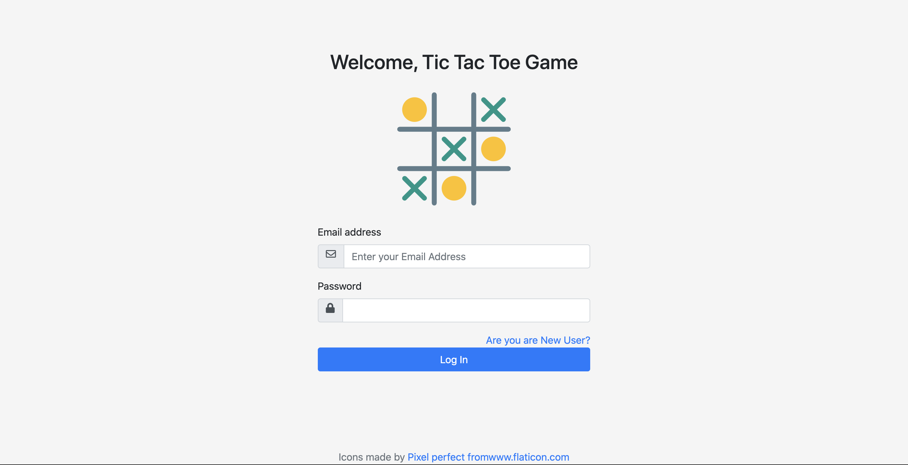
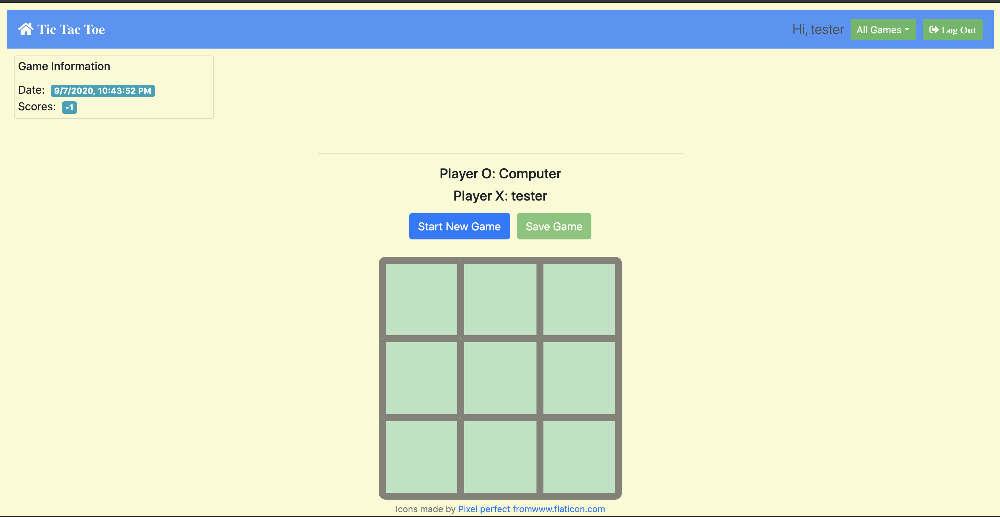
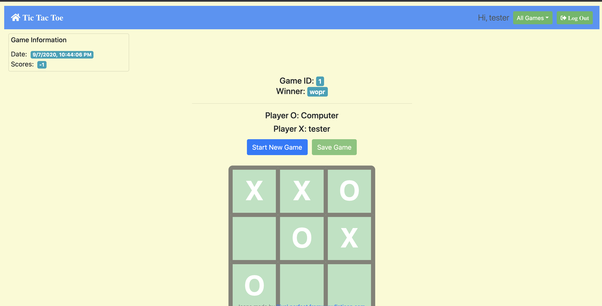

# TicTacToe
## Create REST-based API with ExpressJS

> ### Description
--- 
   1. **ttt.js**: the 1st version
      1. there is no UI part. All data will be passed and displayed as JSON
   2. **/tictactoe**: the newest version
      1. **app.js**: the entry point
> ### Description
--- 
   Create a REST-based Tic-Tac-Toe service and take **JSON** object as Input and Output

> ### Features supported
--- 
   1. Develope user-creation system validated with email
      1. Create Inactive User
      2. Send verification code via Email
      3. Able to verify email through url query or Form
   2. Able to save new game and get history data with specified game ID
   3. Comminucate through Ajax Call with JSON data between Server and Client

> ### Techs and Packages used
1. Techs: NodeJS, MongoDB Cloud
2. Packages (for the newest version)
	| Packages/Dependecies | Usage    |
	| -------- | -------- |
   | express  |          |
	| nodemailer| Email usage |
	| express-session| Stores only a session identifier on the client within a cookie and stores the session data on the server|
	| crypto | Generate the key based on password |
   | mongoose | Store User and Game data |
   | winston  | Logger  |
   | forever  |         |
   | pug      | Template Engine |

> ### UI mockups
---
 

More details in **/assets/images** folder

> ### Project Screenshots
---
 

