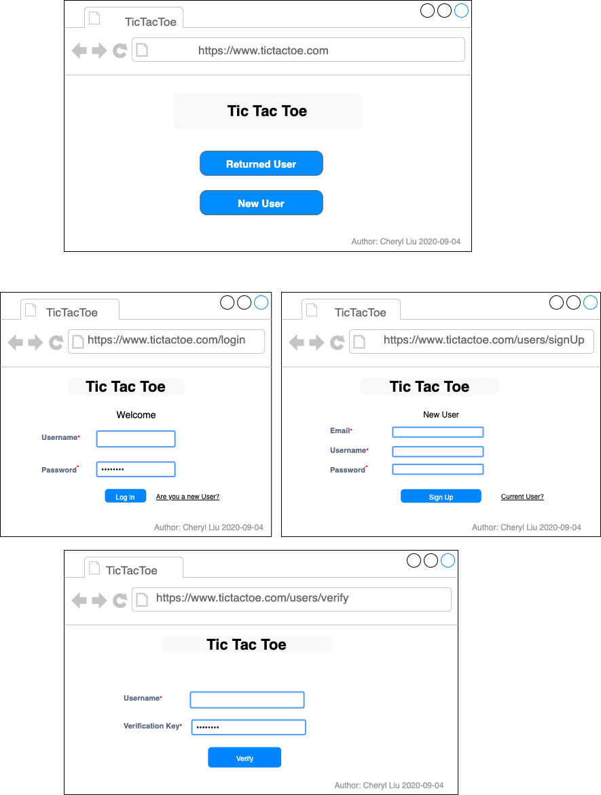

# TicTacToe
## Create Rest API with NodeJS

> ### Description
--- 
1. Create a REST-based Tic-Tac-Toe service and take **JSON** object. Once a winning or tying move has been sent to the server, the server should consider the game completed and reset the grid.
2. Request and Response Format
   1. move: indicate on which square (0-indexed, in reading order) the human is making a move in the current game. It could be 'null' which means without making a move.
   ```json
   // Request JSON format
   {
	   "move": [],
   }
   // Response JSON format
   {
	   "grid": [],
	   "winner":[],
	   "status": "OK", // OK or ERROR
   }
   ```

> ### Features supported
--- 
   1. Develope user-creation system validated with email
      1. **/adduser, { username:, password:, email: }**
         1. create a disabled user
      2. **/verify, { email:, key: }**
         1. key sent via email (backdoor key is “abracadabra”). Optionally, 
         2. Make this API call accept a GET request with the two parameters in the query string, to allow for a direct link from the verification email.
         3. Add cookie-based session support
      3. **/login, {username:, password:}**
      4. **/logout**
   2. Maintain the history of previously played games by each user on the server.
      1. **/listgames**
         1. return JSON object: { status:”OK”, games:[ {id:, start_date:}, …] }
      2. **/getgame, {id: }**
         1. eturn JSOB object: { status:”OK”, grid:[“X”,”O”,…], winner:”X” }
      3. **/getscore**
         1. get { status:”OK”, human:0, wopr: 5, tie: 10 }

> ### Techs and Packages used
1. Techs: NodeJS, Apache2, MongoDB
2. Packages
	| Packages/Dependecies | Usage    |
	| -------- | -------- |
   | express  |          |
	| nodemailer| send key via email(Pay attention: if use gmail, need make your Google account with 'less secure apps' being on)
	| express-session'| support cookie-based session |
	| crypto | Gnerate key

> ### UI mockups
---
<br>



